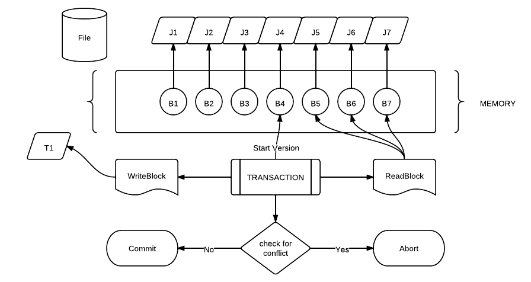
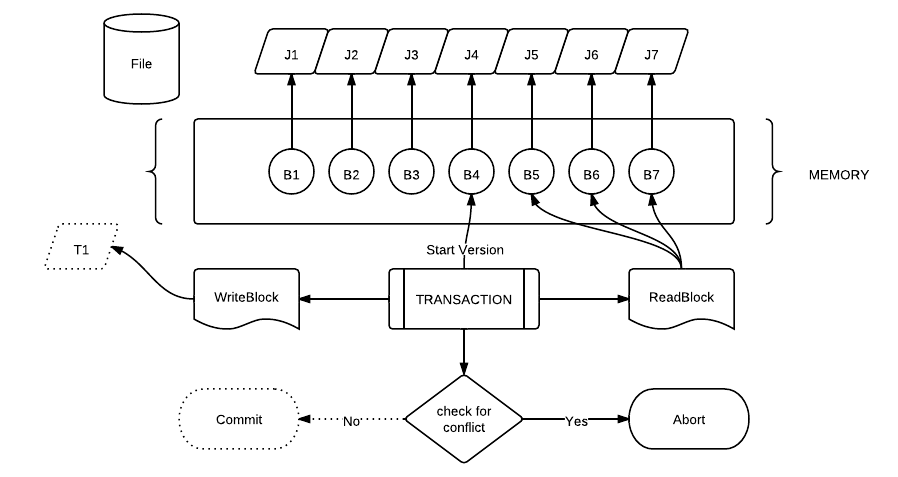
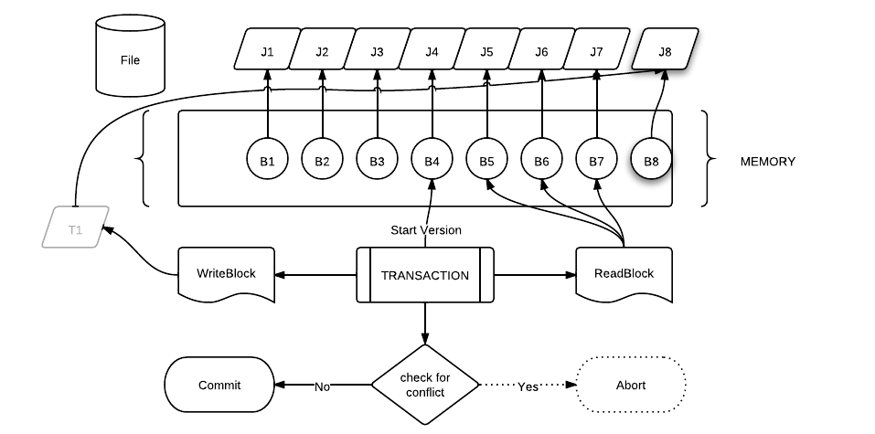

% Concurrent Disk Based Transactions in Haskell
% Satvik Chauhan and Pankaj More 
% April 16 , 2012

# Shared Resource Problem 

* **Problem** : Share a resource between multiple concurrent threads.
* Results in several problems.
* Lost update 
<pre style="border:none;font-size:60%;background-color:#fff">
+----------P1-------------+-----+------------P2------------+
|                         +  1  + w <- read(A)             |
| u <- read(A)            +  2  +                          |
| write(A,u+100)          +  3  +                          |
|                         +  4  + write(A,w+100)           |
+-------------------------+-----+--------------------------+
</pre>
* Incorrect summary problem 
<pre style="border:none;font-size:60%;background-color:#fff">
+----------P1-------------+-----+------------P2------------+
|                         +  1  + w <- read(A)             |
|                         +  2  + write(A,w-100)           |
| u1 <- read(A)           +  3  +                          |
| u2 <- read(B)           +  4  +                          |
| sum = a + b             +  5  +                          |
|                         +  6  + x <- read(B)             |
|                         +  7  + write(B,x+100)           |
+-------------------------+-----+--------------------------+
</pre>
* Many more problems like the above.

# Shared Resource Problem (Cont)

* **Solution** : Locks !!
* Problem with Locks
    * Race Conditions if locks are forgotten. 
    * Deadlocks from inconsistent locks ordering. 
    * Uncaught exceptions might result in any of the above problems. 
    * Coarse Locks hurt performance.
    * Locks don't compose.

# Shared Resource Problem (Cont)

* Two phase locking 
    * Any transaction first must acquire locks for all the shared resources.
    * Perform the operations on the shared resources.
    * Release all the locks.
* Still deadlock problem. 
<pre style="border:none;font-size:60%;background-color:#fff">
+----------P1-------------+-----+------------P2------------+
|                         +  1  + Acquire(A)               |
| Acquire(B)              +  2  +                          |
|                         +  3  + Acquire(B)               |
| Acquire(A)              +  4  +                          |
| Some operations         +  5  +                          |
| Release(B)              +  6  +                          |
| Release(A)              +  7  +                          |
|                         +  8  + Some operations          |
|                         +  9  + Release(A)               |
|                         +  10 + Release(B)               |
+-------------------------+-----+--------------------------+
</pre>

* Can prevent deadlocks by acquiring locks in certain fixed order.
* Still hurts performance

# Transactions 

* An optimistic way of managing shared resources.
* A set of operations which are performed on a resource either fully or none at all. 
* Helps to maintain a consistent view of the resource. 
<pre style="border:none;font-size:60%;background-color:#fff">
+----------T1-------------+-----+------------T2------------+
|                         +  1  + w <- read(A)             |
| u1 <- read(A)           +  2  +                          |
| write(A+100)            +  3  +                          |
| commit                  +  4  +                          |
|                         +  5  + write(A,w-100)           |
|                         +  6  + x <- read(B)             |
|                         +  7  + write(B,x+100)           |
|                         +  8  + commit Fails             |
|                         +  9  + rollback                 |
+-------------------------+-----+--------------------------+
</pre>
* When T2 is rolled back , memory state is same as if T2 has never executed.

# Transactions (Cont)

* **Atomicity** 
    * Transaction either commits or fails 
* **Consistency**
    * Resource is in a consistent state after a transaction commits. 
* **Isolation** 
    * Unaware of the affects of concurrently running transactions. 
* **Durability**
    * Once a transaction commits , changes should persist. 

# Disk Based Transactions

* Schedule
    * A sequence of instructions that specify the chronological
    order in which instructions of concurrent transactions are executed
        * A schedule for a set of transactions must consist of all instructions
        of those transactions
        * A schedule must preserve the order in which the instructions appear in each
        individual transaction.

# Serial Schedule 

* A serial schedule in which T1 is followed by T2
<pre style="border:none;font-size:60%;background-color:#fff">
+----------T1-------------+-----+------------T2------------+
| read(A)                 +  1  +                          |
| A <- A * 2              +  2  +                          |
| write(A)                +  3  +                          |
|                         +  4  + read(A)                  |
|                         +  5  + A <- A - 50              |
|                         +  6  + write(A)                 |
|                         +  7  + read(B)                  |
|                         +  8  + B <- B + 50              |
|                         +  9  + write(B)                 |
+-------------------------+-----+--------------------------+
</pre>
* A serial schedule in which T2 is followed by T1
<pre style="border:none;font-size:60%;background-color:#fff">
+----------T1-------------+-----+------------T2------------+
|                         +  1  + read(A)                  |
|                         +  2  + A <- A - 50              |
|                         +  3  + write(A)                 |
|                         +  4  + read(B)                  |
|                         +  5  + B <- B + 50              |
|                         +  6  + write(B)                 |
| read(A)                 +  7  +                          |
| A <- A * 2              +  8  +                          |
| write(A)                +  9  +                          |
+-------------------------+-----+--------------------------+
</pre>

# Conflicting Instructions

* Instructions Ii and Ij of transactions Ti and Tj respectively, conflict
if and only if there exists some item Q accessed by both Ii and Ij,
and at least one of these instructions wrote Q.
* Intuitively, a conflict between Ii and Ij forces a (logical) temporal order between them.
    * If Ii and Ij are consecutive in a schedule and they do not conflict, their results would remain the same even if they had been interchanged in the schedule.

# Serializabilty

* If a schedule S can be transformed into a schedule S´ by a series of
swaps of non-conflicting instructions, we say that S and S´ are
equivalent
* We say that a schedule S is serializable if it is equivalent to a serial schedule
* Serializabilty provides us with *formalism* for valid interleaving

# Why interleave 

* In a serial schedule, if a transaction waits for an I/O operation to complete, 
CPU cycles are wasted ...
* Other transactions may also be in line waiting for the completion of a 
transaction. (Hint: Convoy effect)
* For these reasons, serial schedules are generally considered unacceptable in 
practice.
* Interleaving could 
    * utilise idle CPU cycles
    * improve "perceived performance"

# A Simplified View of Transactions

* We ignore operations other than read and write instructions
* We assume that transactions may perform arbitrary computations on data in local buffers in between reads
  and writes
* Our simplified schedules consist of only read and write instructions

# Lock Based Implementations 

* Global lock on the database file
* Multiple readers can *share* locks in the absence of writer
* Writer requires *exclusive* locks
* Good for read heavy applications
* Inefficient in case of multiple writers

# Software Transactional Memory (STM)

* New way of programming on multicore systems. 
* Optimistic way of running transactions. 
* Allows all transactions to run simultaneously.
    * Transactions perform changes to their own local buffer. 
    * At the time of commit, decide success or failure. 
    * Success : The changes become simultaneously visible to other threads. 
    * Failure : No changes made to the memory. 
* Compose well. 

# Why Haskell?

* Haskell's expressive power can improve productivity
    * Small language core provides big flexibility
    * Code can be very concise, speeding development
    * Get best of both worlds from compiled and interpreted languages

* Haskell makes code easier to understand and maintain
    * Can dive into complex libraries and understand *what* the code
      is doing

* Haskell can increase the robustness of systems
    * Strong typing catches many bugs at compile time
    * Functional code permits better testing methodologies
    * Can parallelize non-concurrent code without changing semantics
    * Concurrent programming abstractions resistant to data races

* Lots of compiler Optimizations 
    * Fusion, inlining etc

# Haskell is a *pure* functional language

* Unlike variables in imperative languages, Haskell bindings are
    * *immutable* - can only bind a symbol once in a give scope 
      (We still call bound symbols "variables" though)

    ~~~ {.haskell}
    x = 5
    x = 6                      -- error, cannot re-bind x
    ~~~

    * *order-independent* - order of bindings in source code does not
       matter
    * *lazy* - definitions of symbols are evaluated only when needed

    ~~~ {.haskell}
    evens = map (*2) [1..] -- infinite list of even numbers
    main = print (take 50 evens) -- prints first 50 even numbers
    ~~~

    * *recursive* 
    
# Haskell , Transactions and STM 

* Transactions Using Locks 

~~~ {.haskell}
transfer :: Account -> Account -> Int -> IO ()
transfer to from amount = do 
    acquire fromLock
    acquire toLock 
    withdraw from amount 
    deposit to amount 
    release fromLock 
    release toLock
~~~

* Easy to result into deadlocks.

# Haskell , Transactions and STM (Cont)

* STM  

~~~ {.haskell}
withdraw :: Account -> Int -> STM ()
withdraw acc amount = do 
    bal <- readTVar acc
    writeTVar acc (bal - amount) 

deposit :: Account -> Int -> STM ()
deposit acc amount = withdraw acc (-amount)

transfer :: Account -> Account -> Int -> IO ()
transfer to from amount = atomically (do 
    withdraw from amount 
    deposit to amount)
~~~

* No deadlocks 
* Easy to compose 
* Type system prevents any IO operations to be performed inside a transaction.

# Disk Based Transactions 

# Assumptions

* Fsync syscall works as advertised
* The data it reads is *exactly* the same that it previously wrote
* Writing to disk adheres to  block boundaries

# Algorithm

* A single transaction file on which all transactions are done 
* A transaction can be either ReadOnly or ReadWrite
* Each read-write transaction has its own *log*
* read-only transactions don't need any *logs*
* A transaction first writes to its own *log*
* Committing a transaction increments the file version of the transaction file
* Reads from the latest valid *log*

# Algorithm (Cont)

* Queue of *committed logs*
* Bloom filters 

# Commit workflow

# Commit workflow (Cont)

# Commit workflow (Cont)

# Sequencer

* Number of *logs* can grow very fast
* Checkpoint performs the following operations 
    * Merges all the data from *logs* onto the transaction file
    * Removes the *log* reference from the queue
    * Deletes the corresponding *log* file from disk
* Sequencer can be called by the programmer at suitable time

# ACIDity
* **Atomicity** 
    * Transaction either commits or fails 
* **Consistency**
    * The set of *valid logs* + transaction file is always consistent
* **Isolation** 
    * 
* **Durability**
    * Once a transaction commits , fsync must ensure that the data is actually written onto the disk.

# Performance Trade-off

* There is a trade-off between average read performance and average write performance 
* Keep minimum number of *logs* for maximum read performance
    * Checkpoint as frequently as possible
* For maximum write performance , delay checkpoints as far as possible
* The optimum checkpoint frequency depends on the particular performance requirements of the application

# Implementation Details

* We have captured transaction in a monad. 

~~~ {.haskell}
-- Transactions . lhs
-- | Transaction Datatype
data FT a =
    Done a |
    ReadBlock BlockNumber ( ByteString -> FT a ) |
    WriteBlock BlockNumber ByteString ( FT a )
~~~

* Allow 2 operations. 
    * Read data from a block.
    * Write data to a block.

* Monad Instance 

~~~ {.haskell}
-- Transactions . lhs
-- | Monad Definition for the Transaction .
instance Monad FT where
    return = Done
    m >>= f = case m of
        Done a -> f a
        ReadBlock bn c -> ReadBlock bn (\ i -> c i >>= f )
        WriteBlock bn x c -> WriteBlock bn x ( c >>= f )
~~~

# Implementation Details (Cont)

* Example Usage:

~~~ {.haskell}
deposit :: BlockNumber -> ByteString -> FT ()
deposit a x = do 
      amount <- ReadBlock a return 
      WriteBlock a (amount + x) (return ())
~~~

* Explicit notation in terms of bind and return

~~~ {.haskell}
 ReadBlock a return >>= (\amount -> WriteBlock a (amount +x) (return()))
 ReadBlock a (\i -> return i >>= \amount -> WriteBlock a (amount + x) (return()))
 ReadBlock a (\i -> Done i  >>= \amount -> WriteBlock a (amount + x) (return()))
 ReadBlock a (\i -> WriteBlock a (i + x) (return()))
~~~

# Implementation Details (Cont)

* Defining monad instance has 2 advantages
    * Type Checker prevents the user from performing any other IO operations. 
    
    ~~~ {.haskell}
    deposit :: BlockNumber -> ByteString -> FT ()
    deposit a x = do 
        amount <- ReadBlock a return 
        print amount -- Not allowed by type checker 
        WriteBlock a (amount + x) (return ())
    ~~~
    
    * Easy composition 

    ~~~ {.haskell}
    transfer :: BlockNumber -> BlockNumber -> ByteString -> FT ()
    transfer a b x = deposit a (-x) >> deposit b x
    ~~~

    ~~~ {.haskell}
    transfer :: BlockNumber -> BlockNumber -> ByteString -> FT ()
    transfer a b x = do 
        deposit a (-x)
        deposit b x
    ~~~

# Implementation Details (Cont)

* Running a transaction 

~~~ {.haskell}
runTransaction :: FT a -> TFile -> IO a
runTransaction (transfer a b 100)
retryTransaction :: FT a -> TFile -> IO a
retryTransaction (transfer a b 100)
~~~

* runTransaction ensures all the properties of a transaction. 
* Transaction may fail while using runTransaction. 
* retryTransaction ensures that transaction is repeated until it succeeds.
* Too many Journals might result in poor read performance.
* Sequencer copies the data to the main file and remove the intermediate journal files. 

~~~ {.haskell}
sequencer :: TFile -> IO () 
~~~

# Testing 

* Ensuring robustness and quality of the implementation.
* QuickCheck : Tool for type based testing.
* Invariants checked on random testcases generated from the function type. 

~~~ {.haskell}
qsort :: Ord a => [a] -> [a]
qsort (x:xs) = qsort lhs ++ [x] ++ qsort rhs
    where lhs = filter  (< x) xs
          rhs = filter (>= x) xs
-- Quickcheck property to check 
prop_sortcheck xs = qsort (qsort xs) == qsort xs
~~~ 

~~~ {.haskell}
ghci> quickCheck (prop_sortcheck :: [Integer] -> Bool)
*** Failed! Exception: 'qsort.hs:(3,1)-(5,32): Non-exhaustive patterns in function qsort' (after 1 test): 
[]
~~~ 

* Correcting the code 

~~~ {.haskell}
qsort [] = []
~~~ 

~~~ {.haskell}
ghci> quickCheck (prop_sortcheck :: [Integer] -> Bool)
+++ OK, passed 100 tests.
~~~

# Testing (Cont)

* Keeping things pure. 
* Easier to reason about code with no side effects.
* Simulate File system without actually performing IO for testing purposes.
* Different types for actual code and testing code. 
* Type Classes.

~~~ {.haskell}
-- Backend.hs
class (Show a,Monad m) => Backend b m a | b -> m where 
    data Handle :: * -> * 
    type BlockNumber :: *  
    open :: FilePath -> Mode -> m (Handle b)
    close :: Handle b -> m () 
    readBlock ::(Eq BlockNumber)=>Handle b->BlockNumber->m a 
    writeBlock ::(Eq BlockNumber)=>Handle b->BlockNumber->a->m ()
    sync :: Handle b -> m ()
~~~ 

# Testing (Cont)

* File System being simulated in memory.

~~~ {.haskell}
-- Backend.hs
data TestDisk a = TestDisk {
    disk :: M.Map FilePath (File a)
   , buffers :: M.Map FilePath (File a) 
   , bufferSize :: Int -- Current buffer Size 
   , openFiles :: M.Map FilePath Mode
    } deriving (Eq,Show)
data File a = File {
    blocks :: M.Map Int a 
   , size :: Int 
    } deriving (Eq, Show)

data Mode = ReadWrite | Read | Write deriving (Eq,Show) 
~~~ 

# Testing (Cont)

* Instance of the Backend Class . Pure and no side effects. 

~~~ {.haskell}
instance Show a => Backend (TestDisk a)  (State (TestDisk a)) a where 
    data Handle (TestDisk a) = Handle FilePath 
    type BlockNumber = Int 
    open fp m = do 
        disk <- get
        put $ openFile disk fp m 
        return $ Handle fp
    close (Handle fp) = do 
        disk <- get 
        put $ closeFile disk fp
    readBlock (Handle fp) bn = do 
        t <- get 
        case readB t fp bn buffers of 
            Nothing -> error "Block Not Found"
            Just a -> return a
    writeBlock (Handle fp) bn a = do 
        t <- get 
        put $ writeB t fp bn a 
    sync (Handle fp) = do  
        t <- get 
        put $ flushBuffer t fp
~~~

